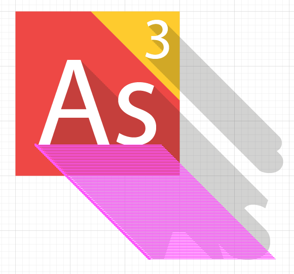

as3logo
=======

If you search online for an AS3 logo you can find different things

this one quite popular

another one

and a couple more.

To promote the ActionScript 3.0 language we thought we should own our logo so we can make it open source and share it with the community.

After some [discussions and contributions](https://github.com/as3lang/www.as3lang.org/issues/2) we decided to go with two main inspirations.

This [design from Yuri Krasnoshek "The Flash"](https://www.behance.net/gallery/24661125/Flash-Flat-Free)

And the [Adobe brand and logo design from the CS3 era](http://veerle-v2.duoh.com/blog/comments/the_new_adobe_icons_and_branding/)

Here the preview of what we obtain

If you are into marketing bullshit here how we would describe it:

    The main red color associated with the yellow associate the identity to "Flash"
    (either the super-hero or the technology), while the long shadow and the 45 degree cut
    emphasize on the "action" of rising from the ashes (as the phoenix), all that
    to say the opposite of "flash is dead", no AS3 is not dead.

How to build the logo
---------------------

We're working in Illustrator but any other tool would do,
we use the Myriad Pro font.

We start with a 3x3 grid to build a rectangle,
we split this rectangle at a 45 degree angle.

We write the letters "As" and allign it to the center,
and push the surrounding box to be alligned to the bottom of the rectangle.

We write the number "3" and allign it top-right.

To build the long shadow, we added a fill.

see this tutorial [Techniques to Create a Trendy Long Shadow Effect](http://design.tutsplus.com/tutorials/quick-tip-techniques-to-create-a-trendy-long-shadow-effect--vector-14473).

We have a main color: red `#f1463f`  
and a secondary color: yellow `#ffcc00`

We fill the background with them.

If you resize the logo those long shadow can be problematic,
so we need to "solidify" them.

First, we need to resize our logo to a 512x512 rectangle,
this to obtain a smoother shadow (to avoid the dent).

Second, we select our font and Object/Expand Appearance

Third, we select the font again and Object/Expand...

Now we copy the background on top and make it a Clipping Mask

You need to do the same thign for all the letters using a shadow.

Here the final result

Here the render with different size

For size less than 32 pixels we think it is preferable to use
only 1 background (red) to offer better readability.

Download the logo
-----------------

